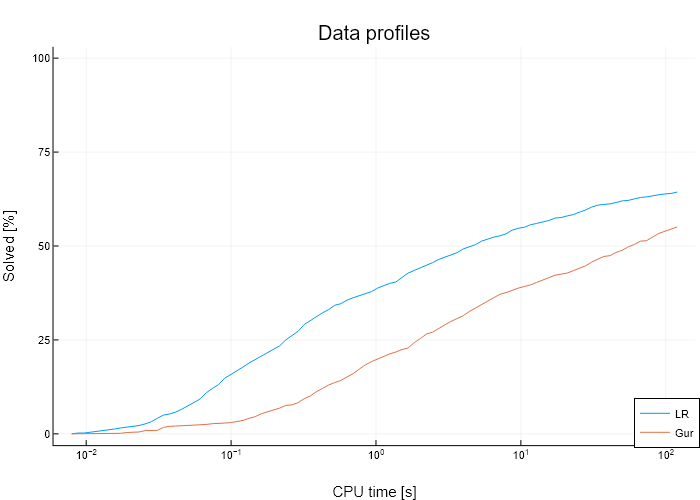
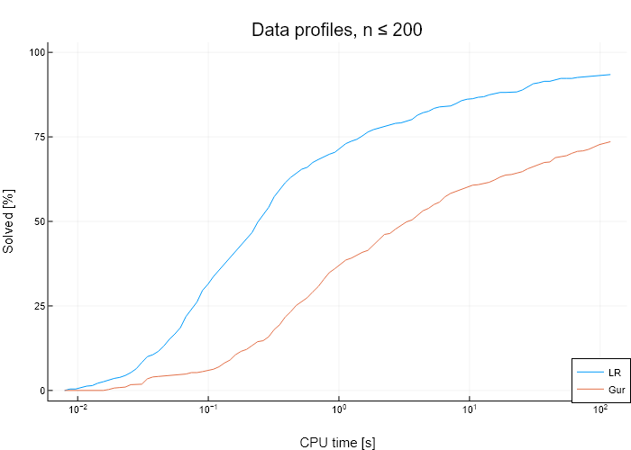

# The LR algorithm on Fanjul-Ruiz instances
In this brief computational study we evaluate the performance of the LR algorithm on the R||C$_\text{max}$ [instances](http://soa.iti.es/files/RCmax.7z) used by [L. Fanjul, and R. Ruiz, (2010)](http://soa.iti.es/publicaciones-108), where the instances are stored with a best known solution obtained with CPLEX 11.1 with 2 hours running time on a Core 2 Duo 2.4 GHz computer. Since CPLEX was used to find these solutions (and sometimes prove optimality) we will denote these results as *CPLEX*. However, since algorithms and computers have improved, therefore we will compare our LR results with a fresh run of Gurobi (both running on the same machine and a single thread). Our machine has a AMD Ryzen 9 3900X 12-Core 3.79 GHz Processor and 32 GB of RAM. Note thus that this is *not* a comparison between Gurobi and CPLEX since a decade of development separates the runs. 

First of all, the optimization model for R||C$_\text{max}$ is denoted as follows
$$\begin{align} &\min& &z \\&\text{s.t.}& \sum_{j\in J} p_{ij}x_{ij}\leq &z, & i \in I\\ && \sum_{i\in I} x_ij =&1,& j \in J\\ && x_{ij}\in &\{0,1\},& i\in I, j\in J. \end{align}  $$
Here $p_{ij}$  denotes the processing time of task $j\in J$ and machine $i\in I$ and $x_{ij}$ the binary decision of processing task $j\in J$ on machine $i\in I$.

The instances are separated in 7 categories: five with $p_{ij}$ originating from a uniform discrete distribution $\{a,\dots,b\}$ denoted $U(a,b)$, namely $U(1,100),U(10,100),U(100,120),U(100,200),U(1000,1100)$;  correlated jobs where $p_{ij} := d_{ij} + b_j$ with $d_{ij}\in U(1,20), b_j\in U(1,100)$; and correlated machines where $p_{ij} := d_{ij} + a_i$ with $d_{ij}\in U(1,20), a_i\in U(1,100)$. Each instance category has multiple sizes where $m:=|I|\in \{10,20,30,40,50\}$ and $n:=|J|\in \{100,200,500,1000\}$, and for each size there are 10 realizations. Hence, each category has 200 instances for a total of 1400 instances.

We have done the following computational experiment (see [solve_instances.jl](solve_instances.jl)), For LR we have used the 'RCmax.exe' with the time limit of 300 s and for instances with 500 or 1000 tasks we have disabled the large neighbourhood search (as this was too computationally expensive) and we have used fewer subgradient iterations (since the subproblems are too computationally expensive to be solved many times when the number of tasks is larger). So, for $n \leq 200$ we used `RCmax.exe $inst_path $T_limit -o $out_path`, otherwise  `RCmax.exe $inst_path $T_limit -o $out_path -nL -nS`. For Gurobi we used the same time limit, a single thread, aggressive cuts, and an absolute gap of $1-\varepsilon$. 
``` 
    set_optimizer_attribute(model,"Threads", 1)
    set_optimizer_attribute(model, "Cuts", 2)
    set_optimizer_attribute(model,"MIPGap", 1e-8)
    set_optimizer_attribute(model,"MIPGapAbs", 0.999) 
```
See [solve_instances.jl](solve_instances.jl) for details. 

## Results on all instances 

Here we group all instances together and compare the results from the three methods: LR and Gurobi (on our machine with a time limit of 300 s) and the previous recorded result CPLEX (2 hours on an older machine). The results are presented in the table:
|                         |    LR | Gurobi | CPLEX |
| -----------------------:| -----:| ------:| -----:|
|            Best sol [%] | 73.86 |  81.93 | 61.21 |
|     Strict best sol [%] |  14.0 |  12.21 |  2.93 |
|          Proved opt [%] | 66.64 |  58.79 | 33.86 |
| Uniquely proved opt [%] |  13.0 |   4.64 |   0.0 |

Here *best sol [%]*  is the fraction of instances for which an algorithm has the lowest makespan, *strict best sol [%]* is the fraction of instance for which an algorithm has a stictly lower makespan than the two other algorithms, *proved opt [%]* is the fraction of instances for which an algorithm is able to prove the optimality of its solution, and *uniquely proved opt [%]* is the fraction of instances for which the algorithm has a proven optimal solution, but the other failed to prove optimality. 

We see that the LR algorithm is, overall, the best one to prove optimality and for 13\% of the instances optimality is proved only by the LR algorithm and not by Gurobi nor previously by CPLEX. To compare the CPU times for the instances solved to optimality we here present a data profile (CPLEX is excluded from the profile since those CPU times comes from another machine). We also show a profile for all small instances ($n\leq 200$), since the LR algorithm originally is designed for such instances. These profiles also confirm that the LR algorithm is, on average, better to prove optimality than Gurobi, especially for smaller instances.    



## Detailed results
To see more detailed results, e.g., by category, problem sizes, objective value, computation times, iterations etc., see [result_tables.md](result_tables.md). There is also a table with the objective values from each algorithm and instance and if it is proven optimal, this table is also in [res_all_instances.csv](res_all_instances.csv). 

In the compressed file [results.7z](results.7z) each folder (corresponding to an instance category) contains all results files "res.txt" (LR algorithm) and "res_gur_cut.txt" (Gurobi algorithm), with statistics such as running times, number of nodes, etc. for each instance.

## Comments
For large instances, we note that a bottleneck for the LR algorithm is the dynamic programming solution for the knapsack subproblems. Therefore, replacing it by a more sophisticated algorithm might improve the results. However, since the LR algorithm heavily relies on the computation of the reduced costs from the dynamic programming approach, this improvement might be non-trivial.